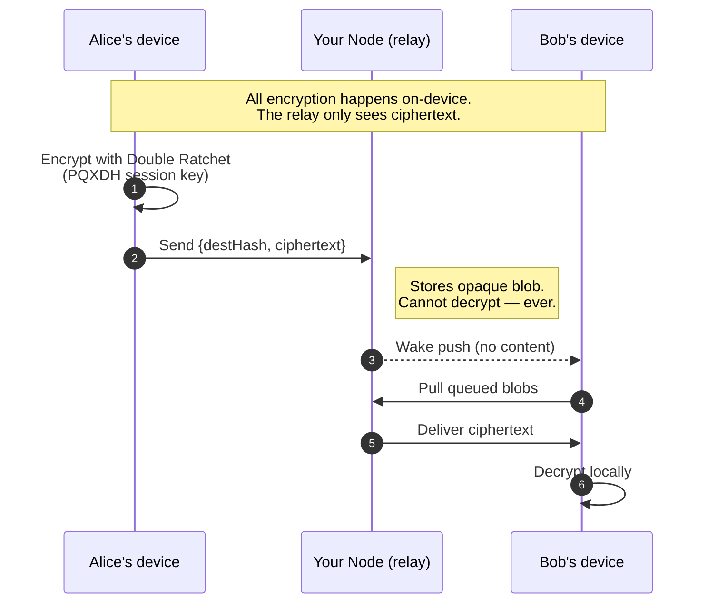
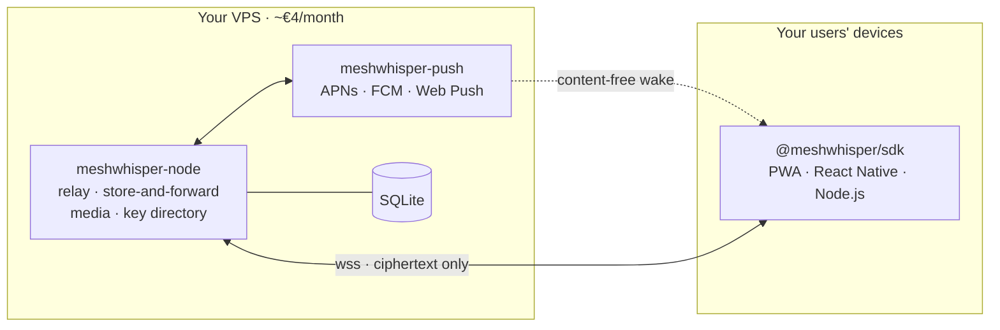

<h1 align="center">MeshWhisper</h1>

<p align="center"><b>Your entire messaging backend is one Docker container.</b></p>

<p align="center">
Self-hosted, post-quantum end-to-end encrypted messaging for any app — PWA, React Native, or Node.js — with a few lines of code and a single container running on the server you already have.
</p>

<p align="center">
<a href="https://meshwhisper.org">meshwhisper.org</a> ·
<a href="docs/getting-started.md">Getting started</a> ·
<a href="docs/api.md">API reference</a> ·
<a href="docs/self-hosting.md">Self-hosting</a> ·
<a href="docs/whitepaper.md">Whitepaper</a> ·
<a href="docs/presentation.pdf">Presentation</a>
</p>

---

## The problem with messaging

Building messaging yourself takes months and you'll get the cryptography wrong. Hosted services like Sendbird cost $2,000/month and can read every message your users send.

MeshWhisper is different. You run the backend. It costs €4/month. And it **cannot read your users' messages** — not as a policy, but by design.

---

## How it works



- Messages are encrypted on-device with the **Signal protocol** (X3DH + Double Ratchet) before they leave the user's device
- Your Node sees only encrypted ciphertext. It routes, stores, and delivers — nothing more
- Push notifications wake the app when a message arrives while it is closed — without the push service seeing message content
- Sessions, identity, and message history persist automatically across page reloads and restarts
- **Encrypted backup is included** — contacts and message history are backed up to your own relay as opaque AES-GCM blobs. No Google Drive, no iCloud, no separate recovery code. Sign in with the same username and password on any device to restore.

---

## What you deploy



Two Docker containers alongside whatever is already on your server:

```yaml
services:
  meshwhisper-node:
    build: ./node
    environment:
      BASE_URL: "https://relay.myapp.com"
      PUSH_WEBHOOK_URL: "http://meshwhisper-push:4000/notify"

  meshwhisper-push:
    build: ./push-service
    environment:
      VAPID_PUBLIC_KEY: "${VAPID_PUBLIC_KEY}"
      VAPID_PRIVATE_KEY: "${VAPID_PRIVATE_KEY}"
      VAPID_SUBJECT: "mailto:ops@myapp.com"
```

```bash
docker compose up -d
```

That is your entire messaging backend. Relay, store-and-forward, push notifications, media hosting, and key exchange directory — all in one container stack.

---

## What you add to your app

```bash
npm install @meshwhisper/sdk
```

```ts
import { MeshWhisper } from '@meshwhisper/sdk';

const mw = await MeshWhisper.init({
  namespace: 'com.example.myapp',
  node: 'wss://relay.myapp.com',
  onMessage: (message) => {
    const text = new TextDecoder().decode(new Uint8Array(message.payload));
    appendToChat(message.senderId, text);
  },
});

// Share this with contacts
const myId = mw.getLocalPeerId();

// Send — X3DH key exchange happens automatically on first contact
await MeshWhisper.send(contactId, new TextEncoder().encode('Hello!'));
```

The SDK auto-detects the environment. In a browser it uses IndexedDB for storage and the native WebSocket API. In Node.js it uses the filesystem and the `ws` package. No configuration required.

---

## Scaffold in 60 seconds

```bash
npx @meshwhisper/cli init
```

Asks for your app bundle ID and server URL. Outputs your `.env` block, SDK init snippet, and a ready-to-use `docker-compose.yml`.

---

## What it costs

| | MeshWhisper | Sendbird | Build it yourself |
|---|---|---|---|
| Monthly cost | ~€4 (your VPS) | $2,000+ | Your engineers' time |
| Can read messages | No — impossible | Yes | Depends on you |
| Time to integrate | 2–4 hours | 1–2 days | Minutes |
| Push notifications | Included | Add-on | Build separately |
| Message history | Included | Included | Build separately |
| Delivery receipts | Included | Included | Build separately |
| Media sharing | Included | Add-on | Build separately |

---

## What it is good for

MeshWhisper is the right choice when **privacy is a feature**, not an afterthought:

- **Healthcare** — patient-doctor messaging where you genuinely cannot access patient communications
- **Legal** — lawyer-client communications where privilege requires confidentiality
- **Finance** — advisor-client messaging with regulatory pressure toward E2EE
- **B2B SaaS** — telling enterprise customers "we cannot read your data even if subpoenaed"
- **Any app** where your users' privacy matters and you want to prove it structurally, not just claim it in a privacy policy

---

## Your node, your users, your namespace

Every MeshWhisper deployment is self-contained. Your node serves your app's namespace. Your users connect to your node. Messages between your users flow through your node. Nothing depends on shared infrastructure, third-party availability, or anyone else's decisions.

In the future, node operators can choose to **peer** with other nodes for redundancy — if your node goes offline, messages route through a peered node temporarily. But peering is optional. Your app works in complete isolation from day one.

---

## Packages

| Package | Purpose |
|---|---|
| `@meshwhisper/sdk` | Client SDK — browser, Node.js, React Native |
| `@meshwhisper/cli` | `npx @meshwhisper/cli init` scaffolding |
| `@meshwhisper/node` | Relay server binary |
| `@meshwhisper/push-service` | APNs / FCM / Web Push dispatcher |
| `@meshwhisper/service-worker` | PWA push event handler |

---

## Documentation

- **[docs/getting-started.md](docs/getting-started.md)** — complete walkthrough from zero to working PWA
- **[docs/api.md](docs/api.md)** — full SDK API reference
- **[docs/self-hosting.md](docs/self-hosting.md)** — server configuration, all environment variables
- **[docs/codebase-overview.md](docs/codebase-overview.md)** — technical overview for contributors and reviewers
- **[docs/multi-device.md](docs/multi-device.md)** — strategy for multi-device support (hand-off, hard boot, linked devices)
- **[docs/whitepaper.md](docs/whitepaper.md)** — full protocol whitepaper ([PDF](docs/whitepaper.pdf))
- **[docs/presentation.pdf](docs/presentation.pdf)** — slide deck overview of the protocol and project

---

## Security model

- Key exchange uses **PQXDH** — a hybrid of X3DH (X25519) and ML-KEM-768. Sessions are post-quantum secure from the first message.
- Session encryption uses the **Double Ratchet** algorithm. Each message uses a fresh key; compromise of one key does not expose past or future messages.
- Your Node sees only encrypted ciphertext and anonymous destination hashes. It cannot identify senders or read content.
- Destination hashes rotate every hour, limiting traffic-analysis windows.
- The push service receives a device token and a destination hash — no message content.
- Identity keys are generated on-device and never transmitted. Private keys are stored only in the device's configured storage backend.
- Media is encrypted locally before upload. The Node stores ciphertext. The decryption key travels through the ratchet-encrypted message channel — never through the Node's HTTP API.
- **Safety numbers** — both parties can verify a 60-digit code out-of-band to confirm no MITM. Computed from a sorted BLAKE3 hash of both Ed25519 identity keys.

For a detailed technical overview see **[docs/codebase-overview.md](docs/codebase-overview.md)**.
